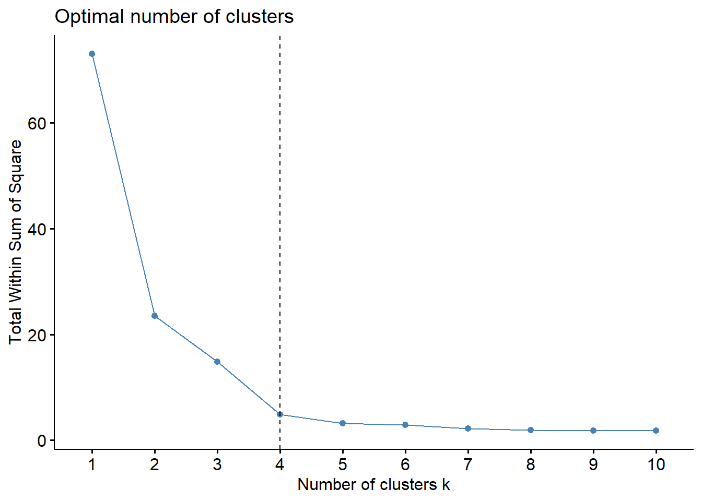

```{r setup, include=FALSE}
knitr::opts_chunk$set(
echo = FALSE,
message = FALSE,
warning = FALSE
)
library(dplyr)
library(tidyr)
library(ggplot2)
library(factoextra)


coty <- read.csv2("C:/Users/Fabrício Giordanelli/Desktop/ALFAPROMOTORA/BASE_COMPLETA.csv", fileEncoding="UTF-8-BOM",stringsAsFactors=FALSE)

coty_cluster <- coty  %>%
  filter(CATEGORIA == "NAILS") %>%
  filter(MARCA %in% c("RISQUE","COLORAMA", "IMPALA"))

coty_cluster <- coty_cluster %>% filter(AREA == "TOTAL BRASIL")

coty_cluster  <- coty_cluster  %>%
  mutate(TOTAL = rowSums(.[13:15]))

coty_cluster  <- coty_cluster  %>%
  select(PRODUTO, FABRICANTE, MARCA, AREA, SDESC,TOTAL)


coty_cluster  <- coty_cluster  %>%
  spread(SDESC, TOTAL)

coty_cluster  <- coty_cluster   %>%
  mutate(media_prod = VALOR/QUANTIDADE)

is.na(coty_cluster) <- sapply(coty_cluster, is.infinite)

coty_cluster <- coty_cluster %>%
  drop_na() %>%
  filter(media_prod>0)


coty_cluster2 <- coty_cluster[,-1]
rownames(coty_cluster2) <- coty_cluster[,1]

coty_cluster2 <- coty_cluster2 %>% select(media_prod)

coty_cluster3 <- scale(coty_cluster2)

```

## Introdução

O agrupamento K-means é um dos algoritmos de aprendizado de máquina não supervisionado mais comumente usados para particionar um determinado conjunto de dados em um conjunto de k grupos (ou seja, k clusters), onde k representa o número de grupos pré-especificados pelo analista.

Ele classifica objetos em vários grupos (ou seja, clusters), de modo que os objetos dentro do mesmo cluster sejam tão semelhantes quanto possível (ou seja, alta similaridade intraclasse), enquanto os objetos de diferentes clusters são tão diferentes quanto possível (ou seja, baixo inter-similaridade de classe).

No agrupamento k-means, cada cluster é representado por seu centro (ou seja, centróide) que corresponde à média dos pontos atribuídos ao cluster.




## Idéias básicas de K-means

A ideia básica por trás do agrupamento de k-means consiste em definir clusters de forma que a variação total dentro do cluster (conhecida como variação total dentro do cluster) seja minimizada.

Existem vários algoritmos k-means disponíveis. O algoritmo padrão é o algoritmo Hartigan-Wong, que define a variação total dentro do cluster como a soma das distâncias quadradas, distâncias euclidianas entre itens e o centróide correspondente:


$W(C_k)=\sum(x_i−μ_k)^2$

$x_i$ se refere a um ponto de dados pertencente ao cluster $C_k$

$μ_k$ é o valor médio dos pontos atribuídos ao cluster $C_k$

Cada observação (xi) é atribuída a um determinado agrupamento de forma que a soma dos quadrados (SS) distância da observação aos seus centros atribuídos do agrupamento μk seja mínima.

Queremos também que a soma total do quadrado do cluster seja a menor possível.

## Estimando o número ideal de clusters

O agrupamento k-means requer que os usuários especifiquem o número de clusters a serem gerados.

Uma questão fundamental é: como escolher o número certo de clusters esperados (k)?

Há diversos métodos.

Aqui, oferecemos uma solução simples. A ideia é calcular o agrupamento k-means usando diferentes valores dos clusters k. Em seguida, o wss (dentro da soma do quadrado) é desenhado de acordo com o número de clusters. A localização de uma dobra (método elbow) no gráfico é geralmente considerada como um indicador do número apropriado de grupos.


```{r echo=FALSE}

library(dplyr)
library(tidyr)
library(ggplot2)
library(factoextra)

coty <- read.csv2("C:/Users/Fabrício Giordanelli/Desktop/ALFAPROMOTORA/BASE_COMPLETA.csv", fileEncoding="UTF-8-BOM",stringsAsFactors=FALSE)


coty_cluster <- coty  %>%
  filter(CATEGORIA == "NAILS") %>%
  filter(MARCA %in% c("RISQUE","COLORAMA", "IMPALA"))

coty_cluster <- coty_cluster %>% filter(AREA == "TOTAL BRASIL")

coty_cluster  <- coty_cluster  %>%
  mutate(TOTAL = rowSums(.[13:15]))

coty_cluster  <- coty_cluster  %>%
  select(PRODUTO, FABRICANTE, MARCA, AREA, SDESC,TOTAL)


coty_cluster  <- coty_cluster  %>%
  spread(SDESC, TOTAL)

coty_cluster  <- coty_cluster   %>%
  mutate(media_prod = VALOR/QUANTIDADE)

is.na(coty_cluster) <- sapply(coty_cluster, is.infinite)

coty_cluster <- coty_cluster %>%
  drop_na() %>%
  filter(media_prod>0)


coty_cluster2 <- coty_cluster[,-1]
rownames(coty_cluster2) <- coty_cluster[,1]

coty_cluster2 <- coty_cluster2 %>% select(media_prod)

coty_cluster3 <- scale(coty_cluster2)


fviz_nbclust(coty_cluster3, kmeans, method = "wss") +
  geom_vline(xintercept = 4, linetype = 2)
```


O gráfico acima representa a variação dentro dos clusters. Ele diminui à medida que k aumenta, mas pode ser visto uma dobra em k = 4. Esta dobra indica que clusters adicionais além do quarto têm pouco valor. Na próxima seção, classificaremos as observações em 4 clusters.


# Criando os clusters

Nesse primeiro momento, não separemos por área nem canal. Então usaremos o Brasil como referência.


```{r, fig.width=12, fig.height=8}
library(grid)
library(gridExtra)
library(kableExtra)
library(ggplot2)
library(ggthemes)
library(haven)
library(readr)

set.seed(123)

km.res=kmeans(coty_cluster3, 4, nstart=25)

coty_cluster4=cbind(coty_cluster2, cluster=km.res$cluster)


kable(sample_n(coty_cluster4,10)) %>%
  kable_styling()

fviz_cluster(km.res, data=coty_cluster4,
             palette = c("#2E9FDF", "#00AFBB", "#E7B800", "#FC4E07"),
             ellipse.type="euclid",
             star.plot=TRUE,
             repel=TRUE,
             labelsize = 9,
             ggtheme=theme_minimal()
)


```
